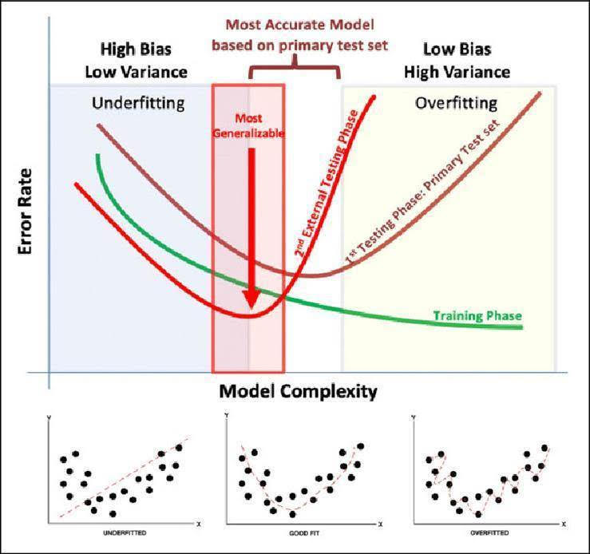
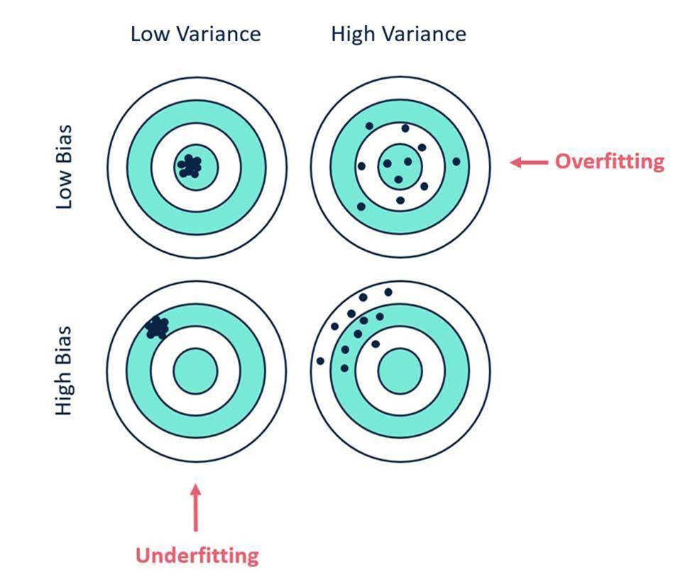

# Bias and Variance

>*在機器學習領域中，"bias"（偏差）和"variance"（變異）是兩個重要的概念，用於描述模型的錯誤。*

>* *偏差（Bias）：偏差是指模型在訓練集上的預測結果與真實結果的差異，描述了模型的學習能力和表現的系統性錯誤。具有高偏差的模型傾向於過於簡單，無法擬合複雜的數據模式。這可能導致模型無法捕捉到數據中的重要特徵，導致預測準確性降低。高偏差的模型常常表現不佳，無法適應訓練數據和測試數據。*

>* *變異（Variance）：變異是指模型在不同訓練集上的預測結果的變化程度，描述了模型對於數據的噪音和隨機性的敏感性。具有高變異性的模型傾向於過於複雜，過度擬合訓練數據的細節和噪音。這可能導致模型對新數據的預測能力很差，無法泛化到未見過的數據。高變異性的模型在訓練集上可能表現很好，但在測試集或實際應用中的表現可能較差。*

以上是ChatGPT並查閱相關文獻後確認整理出的結論

而圖1所表示的是，在相同模型中，若嘗試增加更多的特徵或變數，會增加模型的複雜度(Model Complexity)。在增加模型特徵或變數的情況下，模型能夠更貼合訓練資料的情況（Bias下降）。根據圖1下方的資料，可以觀察到資料呈現出系統性的U型趨勢以及隨機的亂度。假設圖1下方為線性回歸模型（儘管圖1右下方的紅色線條圖並非線性方程式），當使用一個一次方程式進行預測時（圖1左），無法完全捕捉到U型趨勢，表示模型的複雜度不足以貼合資料情況（underfitting）。而當方程式為二次或多次方程式時（中間的圖），方程式能夠捕捉到資料中的U型趨勢（good fit）。然而，若過度增加估計參數，則多次方程式不僅貼合了U型趨勢，還貼合了樣本資料的隨機亂度，這導致了過度擬合的情況（overfitting）。

在統計上也有相同的概念，透過資料的數量和模型的複雜度，產生了名為自由度的指標，作為衡量模型好壞的其中一個依據。在統計領域中，自由度非常重要，因為統計並不是透過不同資料集的表現來衡量模型的好壞。

而圖2解釋了 Bias和Variance的差異。假設靶中心是一個實際的問題。每個點代表著每次實驗所產生的f’(x)，意即我們對這個問題模型化的結果。因為在每次的實驗下，會因為所蒐集到的資料不同，每次訓練出來的估計參數也會不同。在我們使用低複雜度模型進行實驗的形況下，所訓練出的參數並不會差異太大(在圖2上的概念意即為重新打靶的點都落在相近的位置)。但若是在使用高複雜度模型的形況下，若出現overfitting情況，代表在重新抽一批資料時訓練時，不會得到相同的參數(在圖2上的概念意即為重新打靶的點都落在距離非常遠的位置)。圖二作為bias 與 variance的解釋，與precision accuracy的概念相近。

另外再回到圖1的部分，train、1st test、與2st test相當於訓練集、驗證集、測試集上的表現結果。因為訓練資料會直接參與模型的訓練。故在複雜度越高的情況下，越能準確地對訓練資料進行擬合。而驗證集不直接參與模型訓練，故在模型過擬合情況下，會有Error上升的問題。但因為參數挑選、模型比較都是使用驗證集作為比較對象，故在間接參與模型訓練的情況下，依舊會有擬合的現象。反之，測試資料完全沒有參與模型的訓練，故這張圖要說明的是最佳的複雜度通常會比驗證資料集上表現最佳模型的複雜度來的更低。

但以上的情況，僅適用於使用相同模型下，增減模型複雜度的情況。若今天使用了極具代表性的特徵、或是換了完全不同架構的模型。就有機會在不增加Variance的情況下，降低Bias。

參考資料：
1.	WIKIPEDIA 自由度 (統計學). https://zh.wikipedia.org/zh-tw/%E8%87%AA%E7%94%B1%E5%BA%A6_(%E7%BB%9F%E8%AE%A1%E5%AD%A6)
2.	準確度和精確度 (Accuracy and Precision), 國立臺灣大學化學系學士生張育唐/國立臺灣大學化學系陳藹然博士責任編輯. https://highscope.ch.ntu.edu.tw/wordpress/?p=24512
3.	WIKIPEDIA Bias–variance tradeoff. https://en.wikipedia.org/wiki/Bias%E2%80%93variance_tradeoff
4.	Understanding the Bias-Variance Tradeoff, Scott Fortmann-Roe.http://scott.fortmann-roe.com/docs/BiasVariance.html

